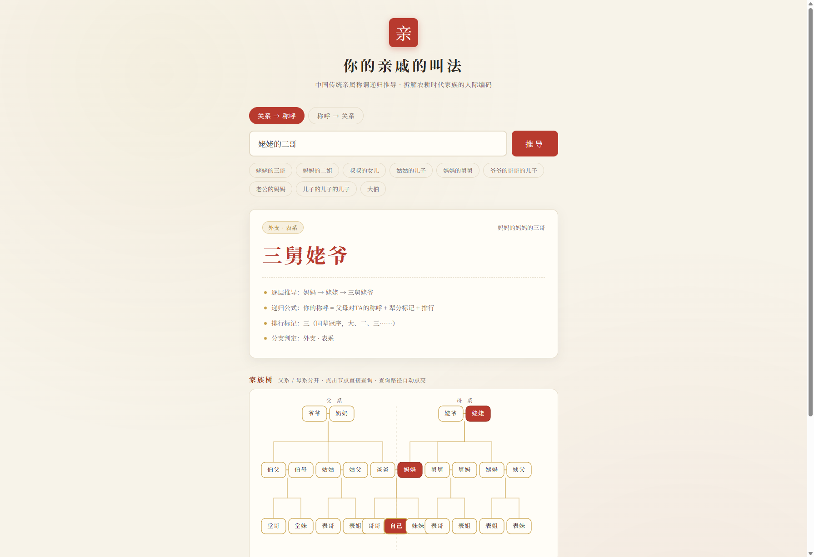

# kinship-nomenclature · 你的亲戚的叫法

> 中国传统亲属称谓推导工具，拆解农耕时代家族的人际编码。
> 不只是一张静态表格，而是可递归推演的亲属关系链。

输入一句关系描述，例如「姥姥的三哥」，直接得到「三舅姥爷」——并展示完整的推导链。



## 在线使用

**[点此直接体验 → https://turbobincn.github.io/kinship-nomenclature/](https://turbobincn.github.io/kinship-nomenclature/)**

打开即可查询，无需安装。

## 本地运行

### 环境要求

- [Node.js](https://nodejs.org/) ≥ 18（Vite 6 的最低要求），自带 npm，无需其他依赖
- 任意现代浏览器（页面为纯静态，构建后零依赖）

### 克隆与安装

```bash
git clone https://github.com/turbobincn/kinship-nomenclature.git
cd kinship-nomenclature
npm install
```

### 开发预览

```bash
npm run dev      # 启动 Vite 开发服务器，默认 http://localhost:5173
```

浏览器打开终端里提示的地址即可查询，修改 `src/` 下代码会热更新。

### 运行测试

```bash
npm test         # 运行 76 个称谓用例（含正反向查询与方言用例）
```

### 构建与预览产物

```bash
npm run build    # 类型检查 + 构建静态页面到 dist/
npm run preview  # 本地预览 dist/ 构建产物
```

### 常见问题

- **双击 index.html 打不开 / 按钮无反应？** 页面使用 ES Module，不能通过 `file://` 协议直接打开，请用 `npm run dev` 或 `npm run preview` 访问。
- **作为库引入**：核心引擎与页面演示分离，可以直接 import 使用：

```ts
import { lookup, reverseLookup } from './src/index'

const r = lookup('姥姥的三哥')
console.log(r.title)        // 三舅姥爷
console.log(r.relation)     // 'biao' —— 外支·表系
console.log(r.chain)        // 逐层推导：妈妈 → 姥姥 → 舅姥爷 → 三舅姥爷

// 方言输出（词根替换，推导逻辑不变）
lookup('姥姥的三哥', { dialect: 'shandong' }).title   // 三舅姥爷（推导链显示：姥姥 → 姥娘）
lookup('妈妈的二姐', { dialect: 'southwest' }).title  // 二孃
lookup('姨妈', { dialect: 'southwest' }).title        // 孃孃

// 反向查询：称呼 → 谁会被这么称呼（枚举路径 + 正向推导建索引，双向自洽）
reverseLookup('三舅姥爷')
// → 妈妈的妈妈的三哥（姥姥的三哥）
// → 妈妈的妈妈的三弟
reverseLookup('表哥')  // 姑姑家的、舅舅家的、姨妈家的儿子都叫表哥 → 多条结果
```

## 方言叫法

称谓的差异不只是「换词」，而是三条结构化的分界线（详见 [dialects.ts](./src/kinship/dialects.ts) 内的资料来源）：

| 维度 | 标准普通话 | 山东 | 西南官话 |
|---|---|---|---|
| 外祖母 | 姥姥 | **姥娘**（姨姥姥 → 姨姥娘） | 姥姥 |
| 妈妈的姐妹 | 姨妈、大姨、二姨 | 姨 / 姨妈 / 姨姨 | **孃 / 孃孃**（二孃、三孃），姨父 → 姨爹 |

解析器同时接受方言输入：「姥娘的三哥」「二孃的儿子」都能直接推导。

## 核心算法：口头上的亲属「递归函数」

> 你的称呼 = 你父母对TA的称呼 + 辈分偏移标记 + 排行

1. **先定是谁**：和爸妈是什么关系（舅 / 姨 / 姑 / 叔 / 伯）
2. **再定高几辈**：高两辈就上爷 / 奶 / 姥（父系用「爷 / 奶」，母系用「姥 / 姥姥」）
3. **最后标排行**：大、二、三……

举一条完整链路：

```
姥姥有个三弟 → 姥姥叫他弟弟
姥姥是妈妈的妈妈 → 母系祖辈，叠【姥】；妈妈的舅父 → 叠【舅】
排行老三 → 三
拼起来：三舅姥爷
```

到了平辈，规则切换成简化版，不用再一层层往上追溯祖辈，直接看来源分支：

| 来源分支 | 判定 | 叫法 |
| --- | --- | --- |
| 爸爸的兄弟（叔伯）一脉 | 同姓本家、祠堂一脉 | **堂**哥 / 堂妹 |
| 姑姑、舅舅、姨妈家子女 | 外支 | **表**哥 / 表妹 |

两条诚实原则：

- **长幼未知不武断**：「姑姑的儿子」比「我」大还是小无从推知 → 输出合并式「表哥(弟)」「堂姐(妹)」；只有直接输入称谓词（表哥、堂妹）才锁定长幼。
- **排行不跨辈**：「四舅家的女儿」的「四」属于舅本人，晚辈排行按同辈另算 → 称谓不冠「四」，只推出「表姐(妹)」；路径中长辈自身（四舅）仍正常冠序。

## 工程结构

```
src/
├── kinship/
│   ├── types.ts    # 原子边模型：F/M/B/Z/S/D/H/W（+长幼、排行）
│   ├── data.ts     # 直呼表 + 归约表（combine）+ 排行模板
│   ├── engine.ts   # 递归推导：title(path) = combine(长辈称谓, title(剩余路径))
│   ├── parser.ts   # 最大匹配分词：「姥姥的三哥」→ [M,M,OB×3]
│   ├── dialects.ts # 方言层：出口词根替换（姥娘 / 孃孃）
│   └── reverse.ts  # 反向查询：枚举路径 + 正向推导建倒排索引
├── tree.ts         # 家族树可视化（零依赖 SVG，节点称谓由引擎推导）
├── index.ts        # 公共 API：lookup()
└── main.ts         # 演示页
```

## Roadmap

- [x] 可视化树状图：父系 / 母系分支分开渲染，节点可点击查询，查询路径自动点亮
- [x] 方言分支扩展（第一层）：山东话（姥娘）/ 西南官话（孃孃）输出与输入
- [x] 反向查询：输入「三舅姥爷」返回关系链
- [ ] 方言第二层：按长幼切分词（南方：母之姐=姨妈 / 母之妹=姨娘）、合并型（渭南：姑姨不分）
- [ ] 曾祖辈及以上更完整的兄弟支系称谓

## 贡献

欢迎提 Issue / PR，尤其是各地方言称谓差异——这正是称谓体系最有意思的部分。

## License

[MIT](./LICENSE)
